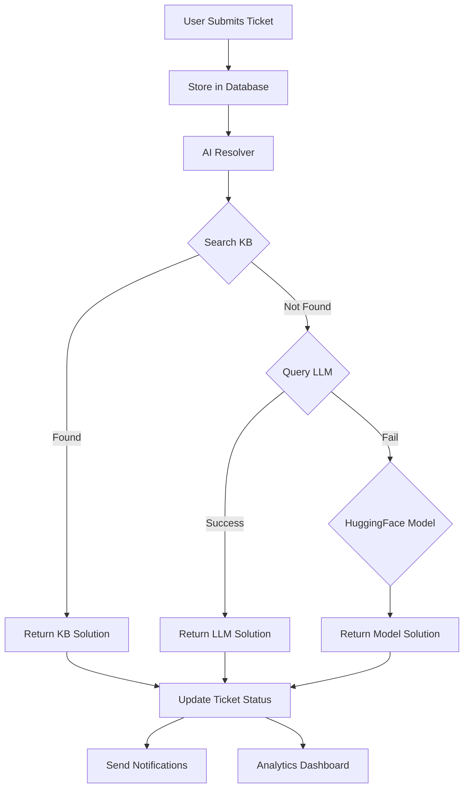

# 🚀 AI-Powered Knowledge Engine

## Project Overview

The AI-Powered Knowledge Engine is an advanced support ticketing system that combines AI-powered assistance, knowledge base integration, and comprehensive analytics. It automates support workflows for developers, enterprises, and software teams.

## 🏗️ Architecture

```
AI-Powered Knowledge Engine
├── 📁 src/                     # Core application modules
├── 📁 kb/                      # Knowledge Base (markdown articles)
├── 📁 data/                    # AI models and indexes
├── 📁 vectorstore/             # FAISS vector databases
├── 🐍 launch_app.py           # Main application launcher
├── 🐍 setup_env.py            # Environment setup utility
├── 📋 requirements.txt        # Python dependencies
└── 📄 .env                    # Environment configuration
```

## 🎯 Key Features

### User Features
- **Anonymous Ticket Submission**: No login required for basic support
- **AI-Powered Solutions**: Multi-tier resolution system (KB → LLM → HuggingFace)
- **Real-time Tracking**: Monitor ticket status and updates
- **Knowledge Base Search**: Browse and search KB articles
- **VS Code Integration**: Submit tickets directly from VS Code

### Admin Features  
- **Role-Based Access**: Secure OTP login for administrators
- **Advanced Analytics**: Interactive dashboards with Plotly/Altair
- **Ticket Management**: View, categorize, and manage all tickets
- **AI Performance Monitoring**: Track resolution rates and model performance
- **Category Escalation Alerts**: Email notifications for problematic categories
- **Google Sheets Integration**: Export and view ticket logs

## 🛠️ Technical Stack

### Backend
- **Python 3.12+** - Core runtime
- **FastAPI** - API framework
- **MongoDB** - Primary database
- **Google Sheets** - Ticket logging

### AI/ML Stack
- **OpenAI GPT** - Primary LLM
- **Google Generative AI** - Secondary LLM
- **HuggingFace Transformers** - Fallback models
- **Sentence Transformers** - Embeddings
- **FAISS** - Vector similarity search
- **scikit-learn** - ML utilities

### Frontend
- **Streamlit** - Dashboard interface
- **Plotly/Altair/Matplotlib** - Data visualization

### External Integrations
- **Tavily API** - Web search capabilities
- **Gmail API** - Email notifications
- **Google Sheets API** - Ticket logging
- **Slack API** - Team notifications

## 🚀 Quick Start

### 1. Prerequisites
```bash
# Ensure Python 3.12+ is installed
python --version

# Install Git (if not already installed)
```

### 2. Environment Setup
```bash
# Clone or navigate to project directory
cd "C:\Users\CHAKRA VARSHINI\Desktop\AI PROJECT_BATCH1"

# Install dependencies
pip install -r requirements.txt

# Set up environment variables
python setup_env.py
```

### 3. Configure API Keys
Create a `.env` file with the following variables:
```env
# AI Model APIs
OPENAI_API_KEY=your_openai_api_key
GOOGLE_API_KEY=your_google_ai_api_key
HF_API_TOKEN=your_huggingface_token

# Google Services
GOOGLE_API_CREDENTIALS=path/to/service-account.json
GOOGLE_SHEET_ID=your_google_sheet_id

# Tavily Web Search
TAVILY_API_KEY=your_tavily_api_key

# MongoDB (if using)
MONGODB_URI=mongodb://localhost:27017/ai_support_system

# Admin Configuration
ADMIN_EMAIL=chakravarshini395@gmail.com
ADMIN_USERNAME=Chakra Varshini
```

### 4. Initialize Knowledge Base
```bash
# Process and index knowledge base
python src/kb_processor.py
```

### 5. Launch Applications

#### Option A: Launch Dashboard
```bash
streamlit run src/dashboard.py
```

#### Option B: Launch Ticket System
```bash
python src/main.py
```

#### Option C: Launch Full Application
```bash
python launch_app.py
```

## 📊 System Components

### Core Modules

#### 1. Ticket Resolution (`src/resolver.py`)
Multi-tier AI resolution system:
1. **Knowledge Base Search** - FAISS similarity search
2. **LLM Resolution** - OpenAI/Google Generative AI
3. **HuggingFace Models** - Specialized transformers
4. **Web Search** - Tavily API integration

#### 2. Knowledge Base (`src/kb_processor.py`)
- Markdown article processing
- FAISS vector indexing
- Semantic search capabilities
- Content gap analysis

#### 3. Dashboard (`src/dashboard.py`)
- Ticket submission interface
- Analytics and reporting
- Admin management
- Real-time monitoring

#### 4. Article Suggestion (`src/article_suggester.py`)
- Context-aware article recommendations
- Usage analytics
- Performance tracking

### Data Flow



## 🔐 Security & Access Control

### Anonymous Users
- Submit tickets without authentication
- View public knowledge base
- Track ticket status with ticket ID

### Admin Users
- **Primary Admin**: Chakra Varshini (chakravarshini395@gmail.com)
- OTP-based authentication
- Full ticket management
- System analytics
- User management capabilities

## 📈 Analytics & Monitoring

### Key Metrics
- Ticket volume and trends
- Resolution success rates
- AI model performance
- Knowledge base effectiveness
- Category escalation patterns

### Visualization Tools
- **Plotly**: Interactive charts and graphs
- **Altair**: Statistical visualizations
- **Matplotlib**: Custom plotting

## 🔧 Configuration Options

### AI Model Priorities
1. **Knowledge Base** (Fastest, most accurate for known issues)
2. **OpenAI GPT** (General purpose, high quality)
3. **Google Generative AI** (Alternative LLM)
4. **HuggingFace Models** (Specialized tasks)
5. **Tavily Web Search** (Latest information)

### Customization
- Model selection per ticket type
- Knowledge base categories
- Escalation thresholds
- Notification preferences

## 🛡️ Troubleshooting

### Common Issues

#### Knowledge Base Not Loading
```bash
# Rebuild KB index
python src/kb_processor.py --rebuild
```

#### API Key Issues
```bash
# Verify environment setup
python src/setup_check.py
```

#### Database Connection Problems
```bash
# Check MongoDB connection
python -c "from pymongo import MongoClient; print(MongoClient().server_info())"
```

## 📝 Development

### Adding New Features
1. Create module in `src/`
2. Update `requirements.txt` if needed
3. Add configuration to `.env`
4. Update documentation

### Knowledge Base Management
- Add markdown files to `kb/` directory
- Run `python src/kb_processor.py` to reindex
- Monitor article usage via dashboard

## 🤝 Contributing

1. Follow existing code structure
2. Add comprehensive docstrings
3. Update documentation
4. Test with multiple AI models

## 📞 Support

For technical support or questions:
- **Admin**: Chakra Varshini
- **Email**: chakravarshini395@gmail.com
- **Project**: AI-Powered Knowledge Engine v1.0

---

**🚀 Ready to revolutionize your support workflows with AI!**